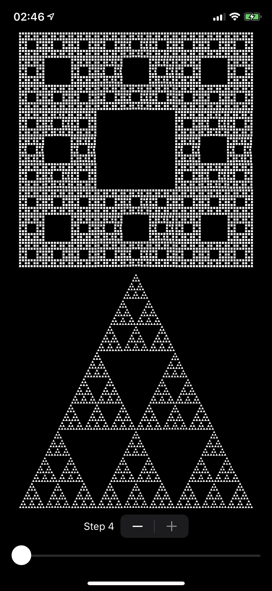

This app demonstrates the Sierpinksi Carpet & the Sierpinksi Triangle using
SwiftUI.

Note that `step == 4` will take a few seconds to render, as SwiftUI is not
meant for recursive layout. :)

## Screenshot

## LICENSE
[MIT](LICENSE)
