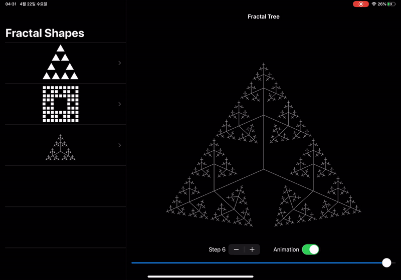
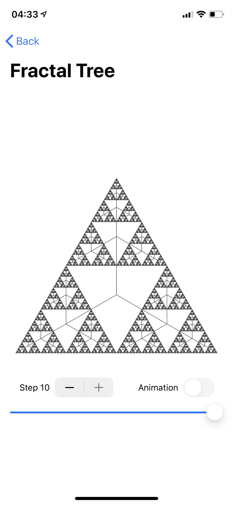

This app demonstrates the Sierpinksi carpet & triangle, and a fractal tree using
SwiftUI.

Note that animations are disabled for large `step` values; otherwise SwiftUI will give up rendering.

## Screenshot

## LICENSE
[MIT](LICENSE)
